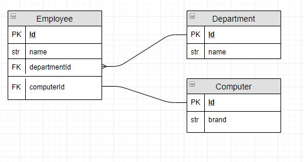

#Practice: Small Business
A small business wants to keep track of its employees and the computers that they use. Each employee is assigned to a department, and they each get assigned a computer when they join the company.

Build arrays of objects that represent Employees, Departments, and Computers.
Assign every resource a unique id property.
Assign each employee to a department using a foreign key.
Assign each employee a computer using a foreign key.
Once your data is normalized, use your DOM skills to display a card for each employee. It should display the employee name, the name of their department, and which computer they are using
```js
<article class="employee">
    <header class="employee__name">
        <h1>Rainu Ittycheriah</h1>
    </header>
    <section class="employee__department">
        Works in the IT department
    </section>
    <section class="employee__computer">
        Currently using a 2015 MacBook Pro
    </section>
</article>
```